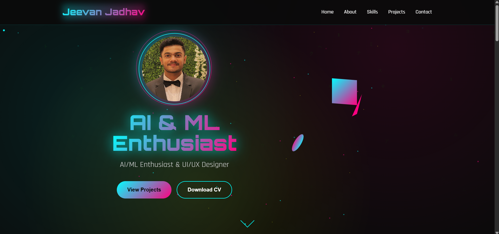
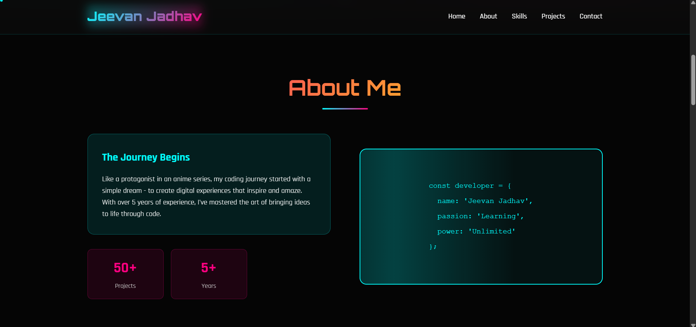

# Portfolio Template 7

A clean, single-page developer portfolio template built with plain **HTML, CSS and JavaScript**.  
Lightweight and easy to customize — includes a hero/avatar section, projects screenshots, background image assets and scripts for interactivity.

> **Repository snapshot:** contains `Portfolio7.html`, `style7.css`, `script7.js`, image assets and screenshots. Licensed under **MIT**. :contentReference[oaicite:1]{index=1}

---

## Demo / Screenshots

  


---

## Features

- Single HTML file (`Portfolio7.html`) for quick local preview and deployment. :contentReference[oaicite:2]{index=2}  
- Styling with a dedicated CSS file (`style7.css`) and interactivity via `script7.js`. :contentReference[oaicite:3]{index=3}  
- Avatar / profile images included (e.g. `Jeevan.jpg`, `Zhongli.jpg`) and background `bg.jpg`. :contentReference[oaicite:4]{index=4}  
- Responsive layout (designed to be a simple one-page portfolio).  
- MIT license — free to use and modify. :contentReference[oaicite:5]{index=5}

---

## How to use / Run locally

1. Clone the repository:
   ```bash
   git clone https://github.com/NOVA0206/Portfolio-Template-7.git
   cd Portfolio-Template-7

2. Open the site locally:

   * Double-click `Portfolio7.html` or open it from your browser (`File → Open File...`) to preview.
   * Or serve it with a simple HTTP server for correct loading of assets (recommended):

     ```bash
     # Python 3
     python -m http.server 8000
     # then open http://localhost:8000/Portfolio7.html
     ```

---

## Customization guide

To personalize the template:

* **Change name / text** — open `Portfolio7.html` and update the hero, about and project descriptions.
* **Replace avatar / images** — swap `Jeevan.jpg` (or other image files) with your own images keeping the same filenames or update paths in the HTML.
* **Adjust styles** — edit `style7.css` (colors, fonts, spacing).
* **Modify behavior** — update `script7.js` to tweak animations, nav behavior, or add components.
* **Add projects** — copy the project card markup in `Portfolio7.html` (or wherever the project section is implemented) and replace images/text.

---

## License

This project is licensed under the **MIT License** — see `LICENSE` for details. ([GitHub][1])

---

## Author / Contact

Template files include images named `Jeevan.jpg` (Author).

Repo Owner: **NOVA0206** 

Gmail: **jeevanj020604@gmail.com** 

Name: **Jeevan Jadhav**

---

[1]: https://github.com/NOVA0206/Portfolio-Template-7.git "GitHub - NOVA0206/Portfolio-Template-7"
